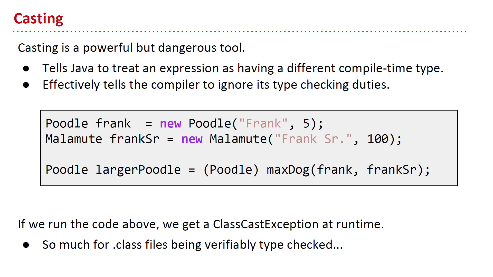
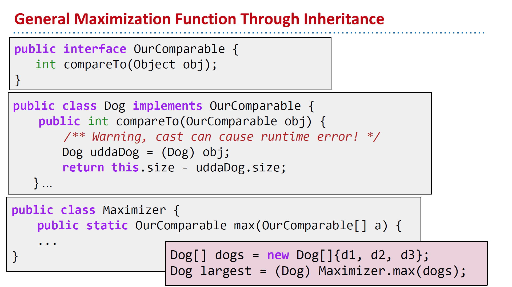

# CS61B: Code and Notes

## Introduction

Code for cs61b, both skeleton and implementations. Besides, notes and solutions to some problems are recorded.

## Settings

### alias: `subl` and `md`

To avoid typing in `Git Bash` each time I run it the following 2 lines:

```
alias subl='"C:\Program Files\Sublime Text 2\sublime_text.exe" $@'
```

I follow instruction [Setting up Sublime](https://www.udacity.com/wiki/ud775/sublime), create a `.bashrc` at `C:\Users\CYS` with following content. Remember to put `\` before any `Space`, `(` and `)`.

```
alias subl="C:/Program\ Files/Sublime\ Text\ 2/sublime_text.exe"
```

### Markdown Editor

I follow instruction [here](http://www.cnblogs.com/IPrograming/p/Sublime-markdown-editor.html), use `Sublime Text` as my Markdown editor. For more detail, view [here](http://m.blog.csdn.net/article/details?id=51235792).

Attaching pictures into Markdown is what I concern. First, I follow instruction [here](https://www.tekrevue.com/tip/how-to-take-and-manage-screenshots-in-windows-8/), make screenshots restored in `pics/`. Second, follow instruction [here](http://stackoverflow.com/questions/10189356/how-to-add-screenshot-to-readmes-in-github-repository) to set relative link for pictures accessing. The result can only be viewed via Github, as relative link is only supported by Github instead of plugins for `Sublime Text`.

## Git

### Revert Git repository to previous commit

I have pushed commit to Github, and want to revert to that commit in my local repository. I follow instruction [here](http://stackoverflow.com/questions/4114095/revert-git-repository-to-a-previous-commit) and make it. In short, copy the commit No. from Github, and type in `git reset --hard xxxx` in local command line.


## Notes 

### lec9: Extends, Casting, Higher Order Functions

**Constructors are not inherited.** However, the rules of Java say that all subclass constructors must start with a call to a constructor for the super class. If not, then `VengefulSList`'s `sentinel` would be null, which is bad.

```java
// These constructors are exactly equivalent.
// Given VengefulSList extends SList, which stores items deleted.

public VengefulSList(){
	deletedItems = new SList<Item>();
}

public VengefulSList(){
	super();
	deletedItems = new SList<Item>();
}
```


----------


**Implementation Inheritance Breaks Encapsulation**. Uses following example to show that. Consider a dog.

```java
class Dog{
	public void bark() {
	   System.out.println("bark");
	} 
	public void barkMany(int N) {
	   	for (int i = 0; i < N; i += 1) {
	      	bark();  
	   	}
	}
}
```

However, a dog can also implement its `bark` as a special case of `barkMany`.

```java
class Dog{
	public void bark() {
	   barkMany(1);
	}
	public void barkMany(int N) {
	   	for (int i = 0; i < N; i += 1) {
	      	System.out.println("bark");  
	   	}
	}
}
```

If class `verboseDog` inherits `Dog`, we see how problems appear.

```java
class verboseDog extends Dog{
	@Override
	public void barkMany(int N) {
	    System.out.println("As a dog, I say: ");
		for (int i = 0; i < N; i += 1) {
	       	bark();
		}
	}
}

public static void main(String[] args){
	verboseDog vb = new verboseDog();
	vb.barkMany(3);
}
```

If `Dog` class is actually implemented in the 2nd way, then bug comes. It prints "As a dog, I say: " and never ends.


----------


**Compile-time type and Runtime type**. Even though `sl` "points to" `VengefulSList` object, that its runtime type is `VengefulSList`, `sl` is declared as `SList` variable, that its compile-time type (static type) is `SList`.


Casting forces the compile-time type of any expression, but it maybe dangerous. WHY?



----------

**High Order Function** is a function that takes other functions as input. In `Python`, HoF works like:

```python
def TenX(x):
	return 10 * x

def do_twice(f, x):
	return f(f(x))

print do_twice(TenX, 10)
```

In `Java`, it takes following steps to accomplish the same task:

```java
public interface IntUnaryFunction{
	public int apply(int x);
}

public class TenX implements IntUnaryFunction{
	public int apply(int x){
		return 10 * x;
	} 
}

public class HoFDemo{
	public static int do_twice(IntUnaryFunction f, int x){
		return f.apply(f.apply(x));
	}
	public static void main(String[] args){
		System.out.println(do_twice(new TenX(), 10));
	}
}
```

----------

### lec10: Abstract Classes, Practical HoFs

**Rule on dynamic/static type: ** Overridden non-static methods are selected at run time based on dynamic type, everything else is based on static type.

```java
//suppose ShowDog is subtype of Dog

Object o2 = new ShowDog("Mortimer", "Corgi", 25, 512.2);

ShowDog sdx = (ShowDog) o2;
sdx.bark(); //ShowDog's bark()

Dog dx = (Dog) o2;
dx.bark(); //also ShowDog's bark()

((Dog) o2).bark(); //also ShowDog's bark()

Object o3 = (Dog) o2;
o3.bark(); //an Object instance cannot bark 
```

QUESTION: 
- What if a subclass has variables with the same name as a superclass?
- What if subclass has a static method with the same signature as a superclass method? 

ANSWER:
These are called **hiding**(two static methods with the exact same signature). Don't do that.

----------

**Abstract Classes vs. Interfaces**: try to use interfaces whenever possible.

----------

**General Function** can be implemented through inheritance. For example, we want to compare between two dogs, but `>` is not a choice, as operator overloading does not exist in `Java`. Also, special `compareDog` function is not good. We solve this using interface and inheritance, creating a general maximizer.



In this way, maximizer operates on multiple types gracefully, e.g.

```java
OurComparable[] objs = getItems("somefile.txt");
return Maximizer.max(objs);
```


